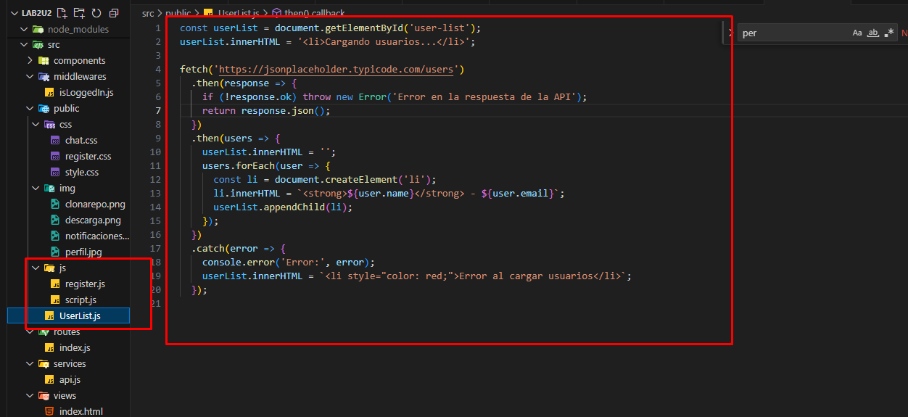

# Desarrollo de Chat Web Estilo WhatsApp con Lista de Usuarios en Tiempo Real

**Nombre del estudiante:**  
Liseth Poma

---

## RESUMEN

En esta práctica se desarrolló una aplicación web de chat en tiempo real utilizando Node.js, Express y Socket.io para la comunicación bidireccional entre clientes y servidor. El frontend fue construido con HTML, CSS y JavaScript, implementando un diseño estilo WhatsApp Web: la lista de usuarios se muestra en un panel lateral izquierdo y el chat en el panel derecho. Los usuarios se cargan dinámicamente desde una API pública y pueden enviarse mensajes con burbujas diferenciadas. El propósito fue comprender el manejo de sockets, diseño responsivo y la organización del proyecto en un servidor Express, concluyendo en una experiencia interactiva y moderna para el usuario.

**Palabras Claves:** Chat, Socket.io, Frontend

---

## 1. INTRODUCCIÓN

La presente práctica tiene como objetivo desarrollar habilidades en el diseño y programación de aplicaciones web interactivas con tiempo real. El proyecto consiste en crear un chat estilo WhatsApp, incorporando manejo de rutas, servidores Express, eventos con Socket.io y diseño responsivo. Resalta la importancia de aplicar disciplina en la organización del código, el uso de herramientas colaborativas como GitHub y la implementación de estándares modernos de diseño web.

---

## 2. OBJETIVO(S)

### 2.1 Describir los alcances o metas de la práctica o experimento

- Desarrollar una aplicación de chat en tiempo real usando Node.js y Socket.io.
- Implementar un diseño web inspirado en WhatsApp Web, con lista de usuarios y burbujas de chat diferenciadas.
- Integrar una API RESTful para cargar usuarios dinámicamente.
- Comprender la estructuración de un proyecto Express y la separación de vistas y recursos estáticos.

---

## 3. MARCO TEÓRICO

Node.js es un entorno de ejecución para JavaScript del lado del servidor, permitiendo construir aplicaciones escalables y eficientes. Express.js es un framework minimalista para Node.js que simplifica la creación de servidores web y APIs. Socket.io facilita la comunicación en tiempo real entre cliente y servidor mediante WebSockets. El diseño estilo WhatsApp se logra con HTML, CSS flexbox y media queries, ofreciendo una experiencia responsiva. Las APIs RESTful permiten consumir datos de forma estructurada y predecible, facilitando la carga de información de usuarios.

---

## 4. DESCRIPCIÓN DEL PROCEDIMIENTO

**Materiales y herramientas:**
- Node.js v18+
- Editor de código (Visual Studio Code)
- Navegador web
- Terminal de comandos
- Git y GitHub

**Estructura del proyecto:**

**Método:**
1. Inicializar proyecto Node con `npm init`.
2. Instalar dependencias `express` y `socket.io`.
3. Configurar servidor Express en `index.js`, sirviendo la carpeta `/public`.
4. Crear `realTimeServer.js` para lógica de eventos con Socket.io.
5. Desarrollar `index.html` con diseño flexbox: lista de usuarios a la izquierda, chat a la derecha.
6. Implementar `UserList.js` para cargar usuarios desde `jsonplaceholder.typicode.com/users` y gestionar eventos de mensajes.
7. Usar Git para versionar el proyecto y GitHub para alojar el repositorio.

---

## 5. ANÁLISIS DE RESULTADOS

| Aspecto Evaluado            | Resultado Obtenido                                      |
|------------------------------|---------------------------------------------------------|
| Servidor Express             | Configurado para servir archivos estáticos y Socket.io |
| Consumo de API REST          | Usuarios cargados desde jsonplaceholder                |
| Diseño estilo WhatsApp       | Panel lateral con lista de usuarios, chat responsivo   |
| Comunicación en tiempo real  | Mensajes enviados y recibidos usando Socket.io         |
| Organización del proyecto    | Separación clara de rutas, vistas y servidor realTime  |

> Se confirmó la capacidad de comunicar clientes de forma bidireccional, simular conversaciones y desplegar un frontend amigable que replica la experiencia de WhatsApp Web.

---

## 6. GRÁFICOS O FOTOGRAFÍAS

**Imagen 1: Estructura de la interfaz estilo WhatsApp**

> *Vista de ejemplo con fondo estilo WhatsApp, lista de usuarios a la izquierda y burbujas de chat diferenciadas.*

---

## 7. DISCUSIÓN

La implementación de esta práctica permitió aplicar de manera integral conocimientos de desarrollo web, desde la configuración de un servidor Express hasta el consumo de APIs REST y la integración de Socket.io. Al diseñar la interfaz estilo WhatsApp, se reforzó el manejo de CSS flexbox y media queries, garantizando la responsividad en distintos dispositivos. La arquitectura modular del proyecto fomentó buenas prácticas de mantenimiento y escalabilidad. Además, el uso de Git y GitHub facilitó el control de versiones y la colaboración.

---

## 8. CONCLUSIONES

- Se logró implementar exitosamente un chat en tiempo real con Socket.io, demostrando la capacidad de comunicación bidireccional.
- El consumo de una API REST externa permitió cargar dinámicamente una lista de usuarios, mejorando la experiencia interactiva.
- La interfaz responsiva inspirada en WhatsApp Web facilitó la comprensión de técnicas modernas de maquetado web.
- La estructura del servidor Express demostró ser sencilla de configurar y mantener, validando su uso en proyectos reales.

---

## 9. BIBLIOGRAFÍA

- Node.js. 2024. [https://nodejs.org](https://nodejs.org) (Consulta: Junio 2025)
- Express.js. 2024. [https://expressjs.com](https://expressjs.com) (Consulta: Junio 2025)
- Socket.io. 2024. [https://socket.io](https://socket.io) (Consulta: Junio 2025)
- jsonplaceholder. 2024. [https://jsonplaceholder.typicode.com](https://jsonplaceholder.typicode.com) (Consulta: Junio 2025)
- GitHub. 2025. [Repositorio de la práctica](https://github.com/Liseth-Poma/PomaLiseth_Tarea2/tree/mi-implementacion) (Consulta: Junio 2025)
